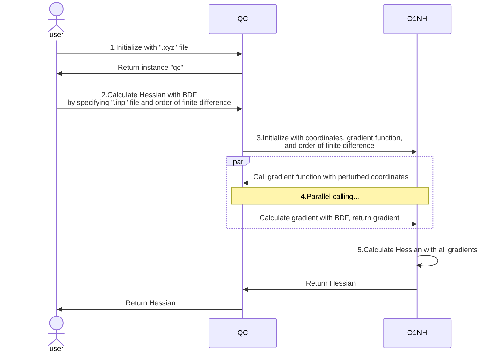

# O1NumHess_QC Documentation

This is a Python module that implements the interfaces of the `O1NumHess` library with chemical software such as BDF and ORCA, enabling the calculation of seminumerical Hessian matrices while only requiring $O(1)$ gradient computations, instead of $O(N)$ gradients (as would be required by a conventional seminumerical Hessian algorithm; $N$ is the number of atoms). This is possible because Hessians are often "local", in the sense that $H_{ij}$ is only non-negligible when $i$ and $j$ correspond to nearby atoms; furthermore, even when the Hessian is not local, its off-diagonal blocks have low rank. Therefore, the Hessian can be very accurately described using $O(N)$ parameters, even though the Hessian has $O(N^2)$ matrix elements. As each gradient possesses $O(N)$ information, it naturally requires only $O(1)$ gradients to determine the Hessian up to a given accuracy. Details of the O1NumHess algorithm, as well as preliminary benchmark results, can be found in our preprint paper: https://arxiv.org/abs/2508.07544

Besides, O1NumHess_QC also implements the conventional single-sided and double-sided numerical differentiation algorithms for seminumerical Hessians, in which the gradients are also calculated in an embarrassingly parallel fashion.

Apart from the `O1NumHess` library, QC only depends on `numpy` as a third-party library for mathematical operations. Related data such as molecular coordinates are stored and returned in `np.ndarray` format. However, note that `O1NumHess` depends on not only `numpy` but also `scipy`.

In the following text, `O1NumHess_QC` is sometimes abbreviated as "QC", and `O1NumHess` is sometimes abbreviated as "O1NH".

**Attention:** Development is not yet complete and things may change. Currently only BDF and ORCA supported, and only the BDF interface is extensively tested.

## Concept (Important)

Here we introduce the basic logic of QC calling O1NumHess to collaboratively calculate the Hessian matrix.

O1NumHess is unrelated to quantum chemistry and calculates the Hessian matrix by accepting a vector $\vec{x}$ and a user-provided gradient function $\vec{g}(\vec{x})$. O1NumHess perturbs each component of the input vector $\vec{x}$ separately, calls function $\vec{g}(\vec{x})$ to calculate the gradient after each perturbation (in an embarrassingly parallel fashion), and finally uses the gradients calculated from the perturbations to derive the Hessian.

QC is responsible for interfacing with quantum chemistry software (such as BDF and ORCA) and does not directly calculate the Hessian. QC encapsulates the functionality of calling BDF and other software to calculate gradients as function $\vec{g}$. When calculating Hessian, QC provides the function $\vec{g}$ and molecular coordinates $\vec{x}$ to O1NH, allowing O1NH to calculate and return the Hessian.

Below is a schematic diagram of using the BDF interface in QC to calculate the Hessian (other softwares work in a similar way): (However, in the future this will not be the most convenient way to run O1NumHess using BDF as the electronic structure program. See section "Usage (with BDF versions released after July 2025)")



1. The user passes the coordinate file `.xyz` of the molecule for which the Hessian needs to be calculated to QC for initialization, and QC returns the initialized object `qc`
2. The user calls the function that uses BDF to calculate the Hessian, specifying the **`.inp` input file for BDF gradient calculation** and the order of finite difference in O1NH
3. QC initializes O1NH based on the parameters provided by the user, using molecular coordinates as the initial value, the function that calls BDF to calculate a single gradient as gradient function g, and specifying the order of finite difference for O1NH
4. O1NH runs multiple instances of the gradient function g simultaneously, to maximize the calculation speed. Each time function g is called, it provides perturbed molecular coordinates to function g, which uses the perturbed molecular coordinates and the `.inp` input file provided by the user in step 2 to call BDF and calculate the corresponding gradient g
5. O1NH collects all gradients obtained in step 4 and finally calculates the Hessian, returning it to the user

In short, O1NH will perturb the molecular coordinates multiple times, passing each perturbed coordinate to gradient function g, which then passes the `.inp` file to BDF for gradient calculation. Therefore, **users need to specify how gradients are calculated in the BDF `.inp` input file**.

## Usage (with BDF versions released before July 2025, or with ORCA)

### Requirement

* Linux System
* python >= 3.6
* numpy
* O1NumHess

### Install & Uninstall

<!-- TODO 配置文件相关的代码有待完善 -->
<!-- root权限 -->

### Important Notes About Path

**Do not include any spaces in your paths!** If spaces appear, paths need to be enclosed in quotes, which may cause problems when parsing and writing files. This includes but is not limited to:

* installation paths of QC and O1NH,
* project storage paths,
* temp directory for the electronic structure software,
* input file names for the electronic structure software,
* external file paths referenced in input files,
* some parameters that will be used as file names.

If support is necessary, please submit an issue.

The tilde `~` will be expanded to the user's home directory.

### Config

During installation, a configuration folder `~/.O1NumHess_QC` will be created, containing example configuration files `xxx_config_example.py` for related software, where `xxx` is BDF or ORCA (or other programs that may be supported in the future). Copy the files `xxx_config_example.py` to `xxx_config.py` and modify them according to your own conditions.

Taking the BDF configuration file as an example, its filename is `BDF_config.py`, and the content is as follows:

```Python
# copy and rename this file to `<program>_config.py` in the same folder,
# modify and write your configs in it.
from textwrap import dedent


config = [
    # below is an example of config, modify it according to your condition of how to run BDF.
    # you can easily write more than one config if you have more than one config to run the program.
    {
        "name": "BDF", # unique name between different configurations
        "bash": dedent(
            # put your bash command below for running BDF successfully
            # make sure there is NO "BDF_TMPDIR", as it's used by several threads together and can't be shared
            """
            #!/bin/bash
            export BDFHOME=/path/to/bdf-pkg-pro
            export USE_LIBCINT=no
            export LD_LIBRARY_PATH=~/intel/mkl/lib/intel64:~/intel/compilers_and_libraries_2019/linux/lib/intel64:$LD_LIBRARY_PATH
            export LD_LIBRARY_PATH=/path/to/bdf-pkg-pro/extlibs:/path/to/bdf-pkg-pro/libso:$LD_LIBRARY_PATH
            ulimit -s unlimited
            ulimit -t unlimited
            """
        ).lstrip(), # use lstrip() to remove the first empty line before #!/bin/bash
        "path": r"/path/to/bdf-pkg-pro/sbin/bdfdrv.py", # program path
    },
]
```

It contains a list named `config`, which includes several dicts. Each dict represents a configuration item. If users have multiple versions of the same software on the same machine, or have different running methods (e.g. using different temp directories during the calculations), they can create multiple dicts following the example.

* The `name` in the dictionary is the unique name of the current configuration item. It is used to specify which configuration item to use when QC is executed, corresponding to the `config_name` parameter when calling QC (see the description in Usage). If there are multiple configurations with the same name, the first one found will be used.
* `path` is the specific path of the corresponding program
* `bash` is part of the `.sh` file that needs to be generated when BDF runs. Another part is dynamically generated by QC at runtime. For details, see the description for each software below.

#### BDF config

For BDF, various environment variables need to be set when BDF runs, so they need to be specified in the `bash` section of the BDF configuration file. The content of this section needs to be manually specified by referring to the example files provided by QC and the [BDF documentation](https://bdf-manual.readthedocs.io/en/latest/Installation.html#run-bdf-standalone-and-execute-the-job-with-a-shell-script).

It should be noted that for the three variables related to the number of cores used, memory amount, and temporary folder path, which correspond to the following in the BDF documentation:

```bash
export OMP_NUM_THREADS=4
export OMP_STACKSIZE=512M
export BDF_TMPDIR=/tmp/$RANDOM
```

Since these three variables differ for each task, QC will generate and complete this part of the code at runtime, so please **do not** specify them in the configuration file.

#### ORCA config

Here is the main part of ORCA configuration:

```python
{
    "name": "ORCA", # unique name between different configurations
    "bash": dedent(
        # put your bash command below for running ORCA successfully
        """
        #!/bin/bash
        # openmpi
        MPI_HOME=/usr/local/openmpi
        export PATH=${MPI_HOME}/bin:$PATH
        export LD_LIBRARY_PATH=${MPI_HOME}/lib:$LD_LIBRARY_PATH
        export MANPATH=${MPI_HOME}/share/man:$MANPATH

        # ORCA 6.0.1 secion
        export LD_LIBRARY_PATH=/path/to/orca:$LD_LIBRARY_PATH
        export PATH=/path/to/orca:$PATH
        """
    ).lstrip(), # use lstrip() to remove the first empty line before #!/bin/bash
    "path": r"/<path to orca>/orca", # program path
},
```

The `bash` part contains 2 parts: "openmpi" for parallel running and "ORCA" main part.

### Initialization

Import O1NumHess_QC and supply a `.xyz` file which contains **only one** set of molecular coordinates for initialization. QC will read the file and store the coordinates in the instance.

* If more than one molecule is contained in the `.xyz` file, an error will be raised.
* If not manually specified by the user, by default the `.xyz` file units will be treated as `angstrom` and read accordingly. Use the `unit` parameter to specify the units of the `.xyz` file. This parameter accepts either `angstrom` or `bohr` as valid string inputs (case-insensitive).
* If there are comments in the `.xyz` file that contain non-ASCII characters, you can manually specify the `encoding` parameter to ensure the file can be read correctly (default is `"utf-8"`)

```Python
from O1NumHess_QC import O1NumHess_QC

qc = O1NumHess_QC("../benzene.xyz")
# or specify the unit of .xyz file manually
qc = O1NumHess_QC("../benzene.xyz", unit="bohr")
# specify encoding to read correctly
qc = O1NumHess_QC("../benzene.xyz", unit="bohr", encoding="utf-8")
```

Since in quantum chemistry, the unit of gradient is Hartree/Bohr and the unit of Hessian is Hartree/Bohr^2, **molecular coordinates are stored in `bohr` units inside QC**. **All subsequent processing is performed in `bohr` units**!

Users can obtain coordinates in `bohr` and `angstrom` units respectively through the following two attributes:

```Python
qc.xyz_bohr
qc.xyz_angstrom
```

The verbosity of the printout during the calculation process can be changed at any time (i.e. including but not limited to just after the initialization of the `qc` object) using `qc.setVerbosity(verbosity)`, where `verbosity` is a non-negative integer. The default `verbosity` is 0, which prints nothing but the most important warnings. Increasing `verbosity` will make the program print more and more diagnostic and timing data.

After initialization is complete, users can call 4 software-related functions to interact with 4 different softwares.

### BDF

If the BDF configuration file is correctly configured, you can use the following code to call BDF to calculate the Hessian matrix. The meaning of each parameter is explained in detail here, please read carefully! For the specific internal working principle, please refer to the `Development` section. Parameters that are labeled "optional" have sensible default values, such that they do not need to be specified provided the user knows that the default values make sense.

```Python
hessian = qc.calcHessian_BDF(
    method = "o1numhess",
    delta = 1e-3,
    core = 4,
    mem = "4G",
    total_cores = 8, # optional
    inp = "../benzene.inp",
    encoding = "utf-8", # optional
    tempdir = "~/tmp", # optional
    task_name = "abc",
    config_name = "BDF",
    dmax = 1.0, # optional, only useful for method="o1numhess"
    thresh_imag = 1e-8, # optional, only useful for method="o1numhess"
    has_g0 = False, # optional, only useful for method="o1numhess"
    transinvar = True, # optional, only useful for method="o1numhess"
    rotinvar = True, # optional, only useful for method="o1numhess"
)
```

* `method`: Currently can only be set to `single`, `double` or `o1numhess` (case-insensitive). Here `single` and `double` represent the order of finite difference when calculating the Hessian via the conventional seminumerical differentiation algorithm, and require $3N+1$ and $6N$ gradients, respectively. `o1numhess` specifies calculating the Hessian using $O(1)$ gradients.
* `delta`: The step length used in perturbing molecular coordinates. As mentioned earlier, molecular coordinates are stored in `bohr` units inside QC, so the perturbation unit is `bohr`! For `method="o1numhess"`, all atoms are simultaneously perturbed in any given displaced geometry, and `delta` is the norm of the difference between the perturbed geometry and the original geometry.
* `core` and `mem`:
  * `core` is the number of cores used when calling BDF to calculate a single gradient, corresponding to the environment variable `OMP_NUM_THREADS` set when running BDF. The type is int and it cannot exceed the number of cores read by the Python code `os.cpu_count()`, i.e. cannot exceed the number of physical cores available for calculation.
  * During actual computation, O1NH will calculate multiple gradients simultaneously based on this value and the total number of cores read by `total_cores` or `os.cpu_count()` (see below).
  * `mem` is the maximum memory size used by **each thread** when calling BDF to calculate a single gradient, corresponding to the environment variable `OMP_STACKSIZE` set when running BDF. The type is str, for example `"4G"` or `"4096M"`
  * For example, when `os.cpu_count()` reads that the current machine has 8 cores and `core = 4, mem = "4G"`, O1NH will calculate 2 gradients simultaneously. Each gradient calculation tells BDF to use 4 cores, with each core using at most 4G memory, so at most 32G memory will be used.
  * For details, see [Installation and Operation](https://bdf-manual.readthedocs.io/en/latest/Installation.html#run-bdf-standalone-and-execute-the-job-with-a-shell-script).
* `total_cores`: (**important**) The total number of cores to be used for the current computing task, None (default) or int type. (This parameter is passed directly to `O1NumHess`, and the following explanation is the internal logic of O1NH)
  * In some cases, not all cores of the current computer can be used for the user's calculations. For example, on a server, users may only be able to use a portion of the cores, or some cores are executing other tasks. This parameter is used to set the total number of cores to be used for this task in such situations. As a concrete example: if the calculation would be submitted to a SLURM queue, then `total_cores` should agree with the `--ntasks-per-node` parameter of the shell script that will be submitted via `sbatch`.
  * This value must be less than or equal to the maximum number of cores in the current system obtained by `os.cpu_count()`; when set to None, the result obtained by `os.cpu_count()` is used by default
  * If either this value or `os.cpu_count()` does not exist or cannot be obtained, a warning will be generated (`os.cpu_count()` may not be able to get a result and return None); if neither exist, an error will be raised
* `inp`: (**important**) Input file for calling BDF to calculate gradients
  * Users should specify the input **information for calling BDF to calculate a single gradient in this file**. All gradients will be calculated based on this input file.
  * In this file, the molecular coordinates to be calculated should be written in the format `file=xxx.xyz`. Refer to the examples in `readme.md` or the official documentation [Input and output formats](https://bdf-manual.readthedocs.io/en/latest/Input%20and%20Output.html#read-the-molecular-coordinates-from-the-specified-file).
  * **About units**: The units in the `.xyz` file are specified during initialization. During calculation, if you want to use bohr as the unit for calculation, you can configure it directly in the inp file, and QC will read the file and convert according to the user's input
    * For example, the units in the `.xyz` file can be angstrom, and the `.inp` file can specify bohr as the unit for calculation. QC will automatically convert coordinates to bohr when calling BDF
  * For details about what happens during calculation and how this `.inp` file is used, please refer to the explanation below and the `Development` section.
* `encoding`: (Optional, default is utf-8) Encoding of the inp input file, used to ensure that the inp file can be read correctly when it contains comments
* `tempdir`: (Optional, default is `~/tmp`) Temporary folder for BDF runtime, corresponding to the environment variable `BDF_TMPDIR` set when running BDF. See [Installation and Operation](https://bdf-manual.readthedocs.io/en/latest/Installation.html#run-bdf-standalone-and-execute-the-job-with-a-shell-script)
  * Please ensure you have write and delete permissions for this folder
* `task_name`: Task name. All files from all calculations of the current task will use this as a prefix to distinguish between multiple tasks.
  * For example, when task_name is `abc`, the related files generated during BDF's first gradient calculation are `abc_001.xxx`, including `abc_001.out`, `abc_001.egrad1`, etc.
  * If this value is not provided, the filename of the `.inp` file will be used as the task name
  * This parameter will be part of the path name, so **spaces are not allowed**!
* `config_name`: Configuration name in the BDF configuration file. The configuration file can contain multiple configurations with different names.
  * If this parameter is empty, the first configuration found in the configuration file will be used by default
  * The purpose of this parameter is: if users have multiple BDF versions or multiple running configurations, they can write multiple configurations in the configuration file and specify the specific configuration to be used for each task.
* `dmax`: (Optional, default is 1.0, unit: Bohr, only useful when method="o1numhess") Cutoff parameter for generating the displaced geometries. The larger `dmax` is, the more displaced geometries are generated (and therefore the more gradients will be calculated), which will improve the accuracy of the Hessian at the expense of increasing the computational cost. Recommended range of `dmax` is 0.0-2.0.
* `thresh_imag` (Optional, default is 1e-8, only useful when method="o1numhess") Cutoff parameter for imaginary frequencies. The Hessian obtained from the first round of gradient calculations is diagonalized, and if any eigenvalue is smaller than -thresh_imag, the Hessian will be `refined` by further displacements along the corresponding eigenvectors. This drastically reduces the tendency of `o1numhess` to overestimate the number of imaginary frequencies. This parameter should better not be touched, as the default value is essentially always appropriate.
* `has_g0` (Optional, default is False, only useful when method="o1numhess") Whether the gradient of the unperturbed geometry is already available in the file task_name+`egrad1`. If yes, `o1numhess` will be able to reuse it, and thus calculate one less gradient.
* `transinvar` (Optional, default is True, only useful when method="o1numhess") Whether translational invariance of the Hessian should be utilized. Normally it is preferred to leave this parameter as True (saves 3 gradient calculations), unless the system experiences an external force that breaks the translational invariance, such as an electric field (including but not limited to one provided by point charges).
* `rotinvar` (Optional, default is True, only useful when method="o1numhess") Whether rotational invariance of the Hessian should be utilized. Normally it is preferred to leave this parameter as True (saves 3 gradient calculations for nonlinear molecules, and 2 for linear molecules), unless the system experiences an external force that breaks the rotational invariance, such as an electric field (including but not limited to one provided by point charges). Note that when the input geometry is not an equilibrium geometry, even the exact Hessian does not obey rotational invariance, but the break of rotational invariance can be exactly calculated from the gradient at the input geometry; the program exploits this if and only if `rotinvar` is `True`.

Assuming the current system has a total of 16 cores and 64GB memory, the complete explanation and corresponding output for the above code are:

* QC will provide O1NH with the molecular coordinates as x, the function that calls BDF to calculate molecular gradients as g, and other parameters needed for BDF calculations during initialization
* O1NH will calculate multiple gradients simultaneously using the `o1numhess` method based on the provided parameters. When calculating each gradient, it perturbs the molecular coordinates in a variety of ways, and calls the gradient function g provided by QC with parameters.
* Since the parameter `total_cores = 8`, 8 of 16 cores will be used for computation. Since the parameter `core = 4, mem = "4G"`, each gradient calculation uses 4 cores with each core using at most 4G memory, 2 gradient calculations will be started simultaneously, using at most 32G memory of 64G.
* The following introduces the process of calculating the first gradient as an example:
* When calculating the first gradient, gradient function g will generate 3 files for calling BDF in the **current working directory** based on task_name `abc`: `abc_001.xyz`, `abc_001.inp`, `abc_001.sh`
  * For `abc_001.inp`, function g will read the input file `"../benzene.inp"` using `"utf-8"` encoding as specified by the `encoding` parameter to ensure correct reading when the file contains comments. After reading, it finds the molecular coordinate section and changes the filename in the `file=xxx.xyz` part to `abc_001.xyz`, thus generating `abc_001.inp`
  * For `abc_001.xyz`, **function g will parse whether the inp file contains instructions specifying coordinate units as Bohr**, and generate the corresponding file with appropriate units based on the situation
  * For `abc_001.sh`, function g will read the current user's BDF configuration file and search for configuration named `"BDF"` in the configuration file based on the `config_name = "BDF"` parameter, obtain BDF's running instructions, and combine with the 3 parameters `core = 4, mem = "4G", tempdir = "~/tmp"` to generate a complete bash file for calling BDF execution
* Subsequently, function g will execute `abc_001.sh` to call BDF to calculate the first gradient.
  * During BDF calculation, it uses the path specified in `tempdir = "~/tmp"` as the temporary folder, generating folders and files like `~/tmp/abc_001/abc_001.xxx` (each gradient calculation will generate an independent folder under `"~/tmp/"` to avoid conflicts)
  * All BDF output files will appear in the **current working directory**, including `abc_001.out`, `abc_001.egrad1`, `abc_001.scforb`, etc., for users to view and check
* **Note**: Due to BDF limitations, all input files generated by gradient function g and output files generated by BDF can only appear in the **current working directory**, which is the path where QC is called and executed. Therefore, to prevent the working directory from being overwhelmed by a large number of files, it is recommended to run QC following the method in "example" part in `readme.md`.
* Finally, function g reads the `abc_001.egrad1` file from BDF's output files to obtain the gradient with units of Hartree/Bohr and returns it to O1NH
* After O1NH receives all the calculated gradients, it calculates the Hessian and returns it, with units of Hartree/Bohr^2
* If method is `o1numhess`: the program checks whether the Hessian has imaginary frequencies, and if yes, it perturbs the geometry along the imaginary modes and calculates the gradients of these perturbed geometries. The gradients are then used to refine the Hessian, so as to improve the accuracy of low-frequency vibrational modes. For very small molecules, all the displace directions will constitute an overcomplete set (i.e. their number will exceed $3N-6$ for non-linear molecules, or $3N-5$ for linear molecules); in this case not all (or even none of) the imaginary modes will be taken into account in the perturbations.

### ORCA

If the ORCA configuration file is correctly configured, you can use the following code to call ORCA to calculate the Hessian matrix.

It is strongly recommended to read the BDF documentation section first, which provides detailed explanations of many parameters, so they will not be repeated here.

```Python
hessian = qc.calcHessian_ORCA(
    method = "single",
    delta = 1e-3,
    total_cores = 12, # optional
    inp = "../ch4.inp",
    encoding = "utf-8", # optional
    tempdir = "~/tmp",
    task_name = "orca",
    config_name = "ORCA",
    dmax = 1.0, # optional, only useful for method="o1numhess"
    thresh_imag = 1e-8, # optional, only useful for method="o1numhess"
    has_g0 = False, # optional, only useful for method="o1numhess"
    transinvar = True, # optional, only useful for method="o1numhess"
    rotinvar = True, # optional, only useful for method="o1numhess"
)
```

* `method`: (see BDF part for details) Currently can only be set to `single`, `double` or `o1numhess` (case-insensitive).
* `delta`: (see BDF part for details) The delta value passed to `O1NumHess` when calculating gradients, in `Bohr` unit.
* `total_cores`: (**important** see BDF part for details) The total number of cores to be used for the current computing task, None (default) or int type.
* `inp`: (**important**) Input file for calling ORCA to calculate gradients
  * Users should specify the input **information for calling ORCA to calculate a single gradient in this file**. All gradients will be calculated based on this input file.
  * In this file, the molecular coordinates to be calculated should be written in the format `* xyzfile Charge Multiplicity Filename`, **QC only supports this format**. Refer to the official documentation for details [5. Input of Coordinates - ORCA 6.0 Manual](https://www.faccts.de/docs/orca/6.0/manual/contents/input.html#reading-coordinates-from-external-files). In particular, the formats `* xyz Charge Multiplicity`, `* pdbfile Charge Multiplicity Filename` etc. are not supported.
* `encoding`: (same as BDF) (Optional, default is utf-8) Encoding of the inp input file, used to ensure that the inp file can be read correctly when it contains comments.
* `tempdir`: (**important**, different with BDF!) (Optional, default is `~/tmp`)
  * ORCA users are frequently accustomed to setting a temporary path, copying all files to this temporary folder for calculation, and copying all result files back to the original path after calculation. This parameter is this temporary path. If the user prefers to run the ORCA job under the current folder (i.e. under the folder where the `.inp` file is currently situated), `tempdir` can be set to the current folder.
  * Please ensure you have write and delete permissions for this folder.
* `task_name`: (same as BDF) All files from all calculations of the current task will use this as a prefix to distinguish between multiple tasks.
* `config_name`: (same as BDF) Configuration name in the ORCA configuration file.
* `dmax`: (same as BDF) Cutoff parameter for generating the displaced geometries.
* `thresh_imag` (same as BDF) Cutoff parameter for imaginary frequencies.
* `has_g0` (similar to BDF) Whether the gradient of the unperturbed geometry is already available in the file task_name+`engrad`.
* `transinvar` (same as BDF) Whether translational invariance of the Hessian should be utilized.
* `rotinvar` (same as BDF) Whether rotational invariance of the Hessian should be utilized.


special notes for ORCA:

* The ORCA section no longer has the independent "number of cores for calculating each gradient" parameter!
  * The number of cores used for each calculation should be directly written in the `.inp` file. For the specific format, refer to point 4 in [3. Calling the Program (Serial and Parallel) - ORCA 6.0 Manual](https://www.faccts.de/docs/orca/6.0/manual/contents/calling.html#hints-on-the-use-of-parallel-orca)
  * QC will parse the number of cores inside and provide it to O1NH, which will dynamically manage the number of cores according to the situation to achieve maximum computational efficiency
* As for memory, it is also written in `.inp` file, via the ORCA keyword `%maxcore`

TODO 关于gbw文件

Except for copying related files to the temporary folder and copying result files back to the current folder, ORCA's operating logic is completely consistent with BDF. For the specific internal working principle, please refer to the `Development` section.

## Usage (with BDF versions released after July 2025)

At the time of writing, the first BDF version with built-in O1NumHess/O1NumHess_QC has not been released to the public yet. Therefore the following information does not apply to any released version of BDF at the time of writing, and may be subject to change in the future.

### Requirement

* Linux System
* python >= 3.6
* numpy
* O1NumHess (comes with the BDF package, does not need to be installed separately)

Although the Python environment can be provided with Anaconda, we have received reports that the BDF gradient calculations may occasionally fail with certain configurations of Anaconda. Before we arrive at a portable and reproducible solution, the use of Anaconda is discouraged. Likewise, if there are multiple versions of Python installed on the same machine, care must be taken such that the same version of Python is used while installing BDF and during the calculations. This typically means properly setting the `$PATH` variable in the relevant scripts, or in case the `module` command is available, executing the appropriate `module load` commands both before BDF compilation and before running BDF.

### Install

The O1NumHess and O1NumHess_QC modules are provided as a part of the BDF package. They are installed automatically while compiling BDF; in particular, the user no longer needs to set the BDF config file, as the compilation process knows about all the information required to determine the BDF config file, and will set the config file automatically. For users who only have access to BDF's binaries but not its source code, please consult the [BDF installation guide](https://bdf-manual.readthedocs.io/en/latest/Installation.html), which is available as a part of the BDF manual.

### Invoking O1NumHess_QC from BDF

One can simply add the keyword `O1NumHess` to the `$bdfopt` block of a BDF Hessian input file, which invokes the `o1numhess` algorithm and calculates the Hessian using `O(1)` gradients. In other words, the user does not need to write any Python scripts. Double-sided numerical differentiation can be requested by adding `ParHess` to the `$bdfopt` block of a BDF Hessian input file. Single-sided numerical differentiation is not interfaced yet, as it is normally inferior (in both accuracy and computational cost) to an `o1numhess` run with a large `dmax`. For details, please consult the BDF manual.

## Development

For detailed function explanations, please refer to the specific doc-strings and related comments in the code files. Comments use separators to delineate major steps. Therefore, this section only explains the main logic and some important notes.

### `type: ignore`

The code is developed in VSCode using the `PyLance` extension for "standard" level [type checking](https://microsoft.github.io/pyright/#/configuration?id=type-check-diagnostics-settings). Since Python is dynamically typed, it is unrealistic to make all code pass strict type checking. Therefore, you may sometimes see `# type: ignore` comments in the code, which instructs the type checker to ignore type checking for that specific line.

### BDF

Here we introduce the specific logic of QC interacting with BDF.

QC contains two functions: `calcHessian_BDF` and `_calcGrad_BDF`. `calcHessian_BDF` is responsible for calling O1NH to calculate the Hessian, while `_calcGrad_BDF` is the function g mentioned earlier that can call BDF to calculate gradients.

* After QC initialization, the user calls `calcHessian_BDF`. The `calcHessian_BDF` function receives the relevant parameters and then passes the following parameters to `O1NumHess` to initialize:
  * Molecular coordinates as x
  * The `_calcGrad_BDF` function as gradient function g
  * Other parameters needed when function g calls BDF for calculation (O1NH will then pass these parameters back to `_calcGrad_BDF`)
* It then calls the corresponding function in `O1NumHess` to complete the Hessian calculation according to the user's chosen order of finite difference such as `single` or `double`. The `delta` parameter for molecular perturbation, `core` and `total_cores` parameter for the number of cores to be used need to be passed separately when calling the specific calculation function (see code)
* O1NH will continuously perturb the molecular coordinates x using `delta`. Each perturbation corresponds to one gradient calculation, which is one call to function g. When calling function g, the actual number of cores `core` passed to function g may be adjusted by O1NH according to the situation to achieve maximum computational efficiency
* `_calcGrad_BDF` is the gradient function g that calls BDF to calculate gradients. It accepts the molecular coordinates x perturbed by O1NH, a counter `index`, and other parameters needed from O1NH (they were provided to O1NH during O1NH initialization), thereby performing gradient calculations
* `_calcGrad_BDF` will generate the three files `.inp`, `.xyz`, `.sh` required for BDF gradient calculation based on the received parameters and call BDF for execution (the detailed process has been introduced in "Usage"). Finally, it reads the `.egrad1` file from BDF's output results to obtain the gradient and returns it to O1NH
* After O1NH receives all the calculated gradients, it calculates the Hessian, and the entire process is complete (except when the method is `o1numhess` where further gradient calculations may be needed to refine the imaginary modes).

### ORCA

Here we introduce the specific logic of QC interacting with ORCA.

Similar to BDF, QC contains two functions: `calcHessian_ORCA` and `_calcGrad_ORCA`. `calcHessian_ORCA` is responsible for calling O1NH to calculate the Hessian, and `_calcGrad_ORCA` is the function g mentioned earlier that can call BDF to calculate gradients.

The logic of `calcHessian_ORCA` is similar to BDF, but it first reads the `.inp` file and parses the number of cores used for calculating each gradients as the `core` parameter to pass to O1NH, and ensures that the `.inp` file contains the `EnGrad` parameter so ORCA will calculate gradients.

For `_calcGrad_ORCA` when calculating each gradients:

* `_calcGrad_ORCA` first reads the `.inp` file
  * Finds the `core` parameter inside and replaces it with the value provided by O1NH
  * Checks whether `Bohrs` units exist inside, as the basis for subsequently generating `.xyz` files
  * Finds and replaces the file path in the `xyzfile` section with the actual file path during calculation
* Generates `.xyz` files based on the units read from the `.inp` file
* Generates `.sh` files based on the user configuration file, which will:
  * Create temporary folders specified by the `tempdir` and `task_name` parameters
  * Copy all files needed for calculation to the temporary folder and change the working path
  * Call ORCA to calculate gradient in the temporary folder
  * Copy all result files back to the directory where it was called
  * Delete the temporary folder
* After calculation is complete, reads from the `.engrad` file and returns the gradient to O1NH
