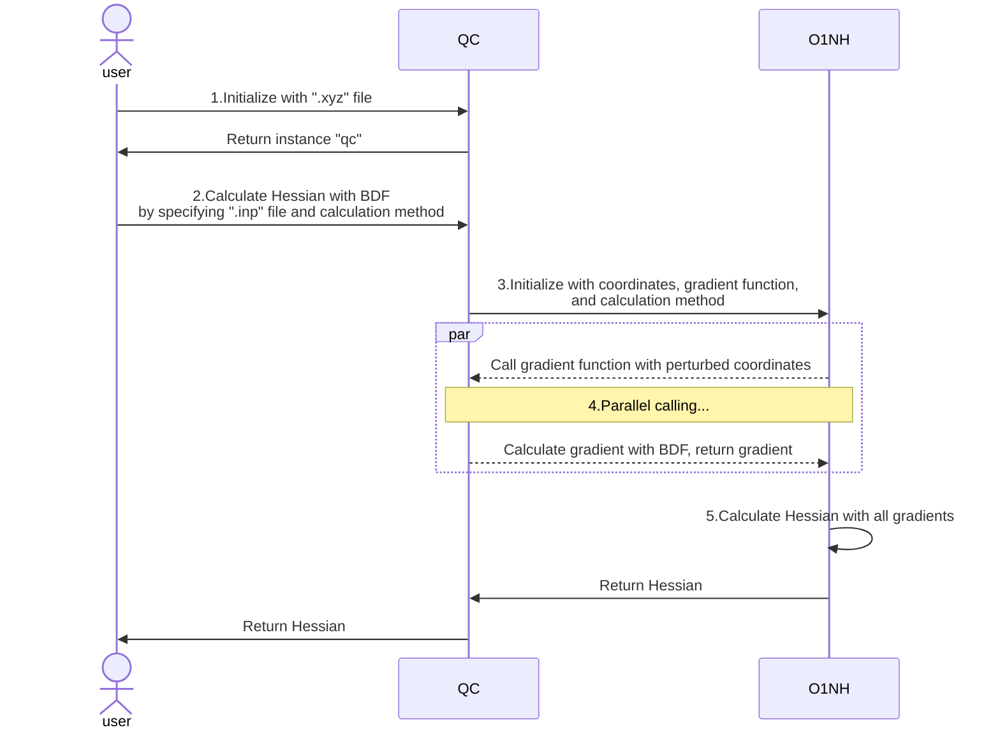

# O1NumHess_QC Documentation

**Attention:** Development is not yet complete, things may change.

除`O1NumHess`库外，QC仅依赖`numpy`一个第三方库进行数学运算，相关的分子坐标等数据均以`np.ndarray`格式进行存储和返回。

In the following text, O1NumHess_QC is sometimes abbreviated as "QC", O1NumHess is sometimes abbreviated as "O1NH".

## Concept (Important)

这里介绍QC调用O1NumHess配合计算Hessian的基本逻辑。

O1NumHess和量子化学无关，通过接受一个向量x和一个用户提供的求梯度的函数g来计算Hessian矩阵。O1NumHess会对输入的x的每个分量分别进行扰动，并调用函数g计算一次扰动后的梯度，最终使用多次扰动后计算得到的梯度来求出Hessian。

QC负责和量子化学相关的软件（BDF等）交互，并不直接计算Hessian。QC将调用BDF等软件计算梯度的功能封装为函数g，在计算坐标时将函数g和分子坐标x提供给O1NH，由O1NH计算Hessian并返回。

下面是一个使用QC里的BDF接口计算Hessian的示意图（其他软件同理）：



1. 用户将需要计算Hessian的分子的坐标文件传递给QC进行初始化，QC返回初始化后的对象`qc`
2. 用户调用利用BDF计算Hessian的函数，并指定**BDF计算梯度的`.inp`配置文件**以及O1NH中利用梯度计算方法
3. QC根据用户提供的参数初始化O1NH，将分子坐标作为初值，将调用BDF计算单个梯度的函数作为梯度函数g，并指定O1NH的计算方法
4. O1NH并行调用QC提供的梯度函数g，每次调用函数g时提供一个扰动后的分子坐标给函数g，函数g利用扰动后的分子坐标和用户在第2步中提供的`.inp`配置文件调用BDF计算得到对应的梯度g
5. O1NH收集第4步中得到的所有梯度，最终计算得到Hessian，返回给用户

简而言之，O1NH会多次扰动分子的坐标，将每次扰动后的坐标传递给梯度函数g，梯度函数g将`.inp`文件传递给BDF计算梯度。因此，**用户需要在BDF的`.inp`配置文件中指明梯度如何被计算**。

## Usage

### requirement

* Linux System
* python >= 3.6
* numpy
* O1NumHess

### Install & Uninstall

<!-- TODO 配置文件相关的代码有待完善 -->
<!-- root权限 -->

### config

安装时，会生成配置文件夹`~/.O1NumHess_QC`，里面会写入相关软件的配置文件样例`xxx_config_example.py`。copy the files `xxx_config_example.py` to `xxx_config.py` and modify it with your own condition.

以BDF的配置文件为例，其文件名为`BDF_config.py`，内容如下：

```Python
# copy and rename this file to `<program>_config.py` in the same folder,
# modify and write your configs in it.
from textwrap import dedent


config = [
    # below is an example of config, modify it according to your condition of how to run BDF.
    # you can easily write more than one config if you have more than one config to run the program.
    {
        "name": "BDF", # unique name between different configurations
        "bash": dedent(
            # put your bash command below for running BDF successfully
            # make sure there is NO "BDF_TMPDIR", as it's used by several threads together and can't be shared
            """
            #!/bin/bash
            export BDFHOME=/path/to/bdf-pkg-pro
            export USE_LIBCINT=no
            export LD_LIBRARY_PATH=~/intel/mkl/lib/intel64:~/intel/compilers_and_libraries_2019/linux/lib/intel64:$LD_LIBRARY_PATH
            export LD_LIBRARY_PATH=/path/to/bdf-pkg-pro/extlibs:/path/to/bdf-pkg-pro/libso:$LD_LIBRARY_PATH
            ulimit -s unlimited
            ulimit -t unlimited
            """
        ).lstrip(), # use lstrip() to remove the first empty line before #!/bin/bash
        "path": r"/path/to/bdf-pkg-pro/sbin/bdfdrv.py", # program path
    },
]
```

其中存在名为`config`的列表，列表中存在若干字典，每个字典即为一个配置文件，用户若存在同一个软件的多个版本或多种运行方式，参照示例生成多个字典即可。

* 字典中的`name`为当前配置的惟一名称，在QC运行时用来指定按照哪一个配置文件运行，对应调用QC时的`config_name`参数（参见Usage中对应软件的说明）
* `path`为对应程序的具体路径
* `bash`为BDF运行时需要生成的`.sh`文件的一部分，另有一部分由QC在运行时动态生成，具体参见后方针对每个软件的说明

#### BDF config

对BDF来说，BDF运行时需要设置各种环境变量，因此需要在BDF配置文件中的`bash`部分指定。该部分的内容需要参考QC提供的示例文件，以及[BDF文档](https://bdf-manual.readthedocs.io/en/latest/Installation.html#run-bdf-standalone-and-execute-the-job-with-a-shell-script)手动指定。

需要注意的是，对于使用的核心数量，内存数量，临时文件夹路径这3个变量，对应BDF文档中的：

```bash
export OMP_NUM_THREADS=4
export OMP_STACKSIZE=512M
export BDF_TMPDIR=/tmp/$RANDOM
```

这3个变量由于每个任务情况不同，QC会在运行时生成这部分的代码并补全。

### Initialization

Import O1NumHess_QC and supply a `.xyz` file which contains **only one** molecular coordinates for initialization. QC will read the file and store the coordinates in the instance.

* If more than one molecule is contained, an error will be raised.
* If not manually specified by the user, by default the `.xyz` file units will be treated as `angstrom` and read accordingly. Use the `unit` parameter to specify the units of the `.xyz` file. This parameter accepts either `angstrom` or `bohr` as valid string inputs (case-insensitive).
* 若`.xyz`文件中存在注释，可手动指定`encoding`参数来确保文件能够被正确的读取（默认为"utf-8"）

```Python
from O1NumHess_QC import O1NumHess_QC

qc = O1NumHess_QC("../benzene.xyz")
# or specify the unit of .xyz file manually
qc = O1NumHess_QC("../benzene.xyz", unit="bohr")
# specify encoding to read correctly
qc = O1NumHess_QC("../benzene.xyz", unit="bohr", encoding="utf-8")
```

由于在量子化学中，梯度的单位是Hartree/Bohr，Hessian的单位是Hartree/Bohr^2，因此在QC内部**分子的坐标会以`bohr`为单位存储**。**后续的处理都是以`bohr`为单位进行的**！

用户可以通过下面的两个属性分别获取到以`bohr`和`angstrom`做为单位的坐标。

```Python
qc.xyz_bohr
qc.xyz_angstrom
```

初始化完成之后，用户可以调用4个软件相关的函数完成和4个软件的交互

### BDF

如果正确配置了BDF的配置文件，可以使用下面的代码调用BDF计算Hessian矩阵。这里详细解释了各个参数的含义，请仔细阅读！具体内部的工作原理请参见`Development`部分。

```Python
hessian = qc.calcHessian_BDF(
    method = "single",
    delta = 1e-3,
    core = 4,
    mem = "4G",
    inp = "../benzene.inp",
    encoding = "utf-8",
    tempdir = "~/tmp",
    task_name = "abc",
    config_name = "BDF",
)
```

* `method`：目前只能设置为`single`或`double`（忽略大小写），代表计算梯度时调用`O1NumHess`所使用的算法。
* `delta`：计算梯度时传递给`O1NumHess`的delta值，该值在O1NH中用来扰动分子坐标。如前所述，QC内部分子坐标以`bohr`进行存储，故扰动的单位为`bohr`！
* `core`和`mem`：
  * `core`为调用BDF计算一次梯度时使用的核心数量，对应运行BDF时设置的环境变量`OMP_NUM_THREADS`，类型为int，该值不可超过Python代码`os.cpu_count()`读取到的核心数量
  * 实际计算时，O1NH会根据该值以及`os.cpu_count()`读取到的核心数量并行计算梯度，例如`os.cpu_count()`读取到当前系统存在8个核心，而`core`的值为4，则O1NH会并行计算2个梯度，每个梯度计算时告诉BDF使用4个核心
  * `mem`为调用BDF计算一次梯度时最大使用的内存大小，对应运行BDF时设置的环境变量`OMP_STACKSIZE`，类型为字符串，例如`4G`或者`4096M`
  * 详情参见[Installation and Operation](https://bdf-manual.readthedocs.io/en/latest/Installation.html#run-bdf-standalone-and-execute-the-job-with-a-shell-script)。
* `inp`：(**important**)调用BDF计算梯度的配置文件
  * 用户应在该文件中写明调用BDF计算一次梯度的配置信息，最终所有的梯度都会依据该配置文件进行计算。
  * 该文件中，要计算的分子坐标应写成`file=xxx.xyz`这样的格式，参考`readme.md`中的例子或者官方文档[Input and output formats](https://bdf-manual.readthedocs.io/en/latest/Input%20and%20Output.html#read-the-molecular-coordinates-from-the-specified-file)。
  * **关于单位**：`.xyz`文件中的单位在初始化时指定，计算时，如果要采用bohr作为单位进行计算，直接在inp文件中配置即可，QC会读取该文件并按照用户的配置进行转换
    * 例如`.xyz`文件中的单位可以是angstrom，`.inp`文件中可以指定单位为bohr进行计算，QC会在调用BDF时自动将坐标转换为bohr
  * 关于计算时具体发生的事情，以及该`.inp`文件如何被使用，请参考`Development`部分对梯度计算过程的解释。
* `encoding`：（可选，默认为utf-8）inp输入文件文件的编码，用来确保inp文件中存在注释时可以被正确读取
* `task_name`：任务名称，当前任务的所有计算的所有文件都将以此为前缀，用来区分多次任务。
  * 例如当task_name为abc时，BDF第1次计算梯度时生成的相关文件为`abc_001.xxx`，包括`abc_001.out`，`abc_001.egrad1`等
* `tempdir`：（可选，默认为`~/tmp`）BDF运行时的临时文件夹，对应运行BDF时设置的环境变量`BDF_TMPDIR`，参见[Installation and Operation](https://bdf-manual.readthedocs.io/en/latest/Installation.html#run-bdf-standalone-and-execute-the-job-with-a-shell-script)
  * 请确保你对该文件夹拥有写入和删除的权限
* `config_name`：BDF配置文件中的配置名称，配置文件中可以存在多个名称不同的配置。
  * 如果该参数为空，默认使用配置文件中找到的第一个配置
  * 该参数的用途是：如果用户存在多个BDF版本或者多个运行配置，可在配置文件中写入多个配置，并指定每个任务使用的具体配置。

假设当前系统有8个核心，32G内存，对于上述的代码，完整的解释和对应的输出为：

* QC会将初始化传入的分子坐标作为x，调用BDF计算分子梯度的函数作为g，以及其他BDF计算需要的参数提供给O1NH
* O1NH根据提供的参数，用`single`方法并行计算梯度。每个梯度计算时，扰动分子坐标中对应的分量，调用QC提供的梯度函数g并传参。由于有8个核心，每次梯度计算使用4个核心和最多4G内存，因此会并行启动两个梯度计算，最多同时使用8G内存。
* 下面以计算第1个梯度的过程为例介绍：
* 计算第1个梯度时，梯度函数g会根据task_name在**当前工作路径**下生成`abc_001.xyz`，`abc_001.inp`，`abc_001.sh`这3个调用BDF的文件
  * 对于`abc_001.inp`，函数g会以encoding参数指定的"utf-8"为编码读取输入文件"../benzene.inp"，以确保文件中含有注释时能够正确读取。读取后找到其中的分子坐标部分，将`file=xxx.xyz`部分的文件名改为`abc_001.xyz`，从而生成`abc_001.inp`
  * 对于`abc_001.xyz`，**函数g会解析inp文件中是否含有指定坐标单位为Bohr的指令**，根据情况生成对应的相应单位的文件
  * 对于`abc_001.sh`，函数g会读取当前用户的BDF配置文件，并根据`config_name = "BDF"`参数，在其配置文件查找名为"BDF"的配置信息，获取BDF的运行指令，结合`core = 4, mem = "4G", tempdir = "~/tmp"`3个参数，生成调用BDF执行的完整bash文件
* 随后函数g会执行`abc_001.sh`，调用BDF计算第1个梯度。
  * BDF计算时，以`tempdir = "~/tmp"`中指定的路径为临时文件夹，生成`~/tmp/abc_001/abc_001.xxx`等文件夹和文件（每个梯度的计算都会在"~/tmp/"下生成独立的文件夹，避免冲突）
  * BDF所有的输出文件均会出现在**当前工作路径**，包括`abc_001.out`，`abc_001.egrad1`，`abc_001.scforb`等，用户自行查看并检查
* **注意**：由于BDF的限制，所有梯度函数g产生的输入文件，以及BDF产生的输出文件都只能出现在当前工作路径下，也就是调用执行QC时的路径。因此为了防止工作路径被大量的文件淹没，建议参考`readme.md`中“example”中的方式运行QC。
* 最终函数g读取BDF输出文件中的`abc_001.egrad1`文件得到梯度，返回给O1NH
* O1NH收到所有计算完毕的梯度后，计算得到Hessian返回，单位为Hartree/Bohr^2

## Development

For detailed function explanations, please refer to the specific doc-strings and related comments in the code files. Comments use separators to delineate major steps. Therefore, this section only explains the main logic and some important notes.

### `type: ignore`

The code is developed in VSCode using the `PyLance` extension for "standard" level [type checking](https://microsoft.github.io/pyright/#/configuration?id=type-check-diagnostics-settings). Since Python is dynamically typed, it is unrealistic to make all code pass strict type checking. Therefore, you may sometimes see `# type: ignore` comments in the code, which instructs the type checker to ignore type checking for that specific line.

### BDF

这里介绍QC和BDF交互的具体逻辑。

QC中存在`calcHessian_BDF`和`_calcGrad_BDF`两个函数。`calcHessian_BDF`负责调用O1NH计算Hessian，`_calcGrad_BDF`即为前文所述的，能够调用BDF计算梯度的函数g。

* QC初始化后，用户调用`calcHessian_BDF`，由`calcHessian_BDF`函数接收相关参数后，将
  * 分子坐标作为x
  * `_calcGrad_BDF`函数作为梯度函数g
  * 函数g调用BDF计算时需要的其他参数
* 传递给O1NH来初始化`O1NumHess`
* 并根据用户选择的`single`或者`double`等计算方法调用`O1NumHess`完成对Hessian的计算。核心数`core`和扰动分子的`delta`两个参数需要在调用具体的计算方法时单独传入（参见代码）
* O1NH会利用`delta`不断的扰动分子坐标x，每扰动一次对应一次梯度的计算，也就是一次对函数g的调用。调用函数g时，可能会根据情况上调实际传递给函数g的核心数`core`，来获取最大的计算效率
* `_calcGrad_BDF`为调用BDF求出梯度的梯度函数g，接受O1NH扰动后的分子坐标x，计数器`index`，以及O1NH在初始化时接收到的其他提供给函数g的参数，从而进行梯度的计算
* `_calcGrad_BDF`会根据收到的参数，生成BDF计算梯度所需的`.inp`,`.xyz`,`.sh`3个文件并调用执行BDF（详细过程已在“Usage”中介绍）。最终读取BDF的输出结果的`.egrad1`文件得到梯度，返回给O1NH
* O1NH收到所有计算完毕的梯度后计算得到Hessian，整个过程完毕。

