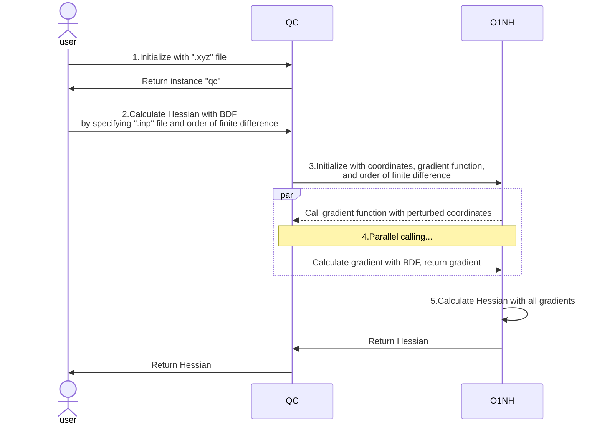

# O1NumHess_QC Documentation

This is a Python library for quantum chemistry calculations. This module implements the interfaces with chemical software such as BDF and ORCA, as well as the `O1NumHess` library, enabling the calculation of Hessian matrices by calling software like BDF while only requiring O(1) times of gradient computations.

Apart from the `O1NumHess` library, QC only depends on `numpy` as a third-party library for mathematical operations. Related data such as molecular coordinates are stored and returned in `np.ndarray` format.

In the following text, `O1NumHess_QC` is sometimes abbreviated as "QC", and `O1NumHess` is sometimes abbreviated as "O1NH".

**Attention:** Development is not yet complete and things may change. Currently only BDF is supported, with support for ORCA and other software to be added in the future.

## Concept (Important)

Here we introduce the basic logic of QC calling O1NumHess to collaboratively calculate the Hessian matrix.

O1NumHess is unrelated to quantum chemistry and calculates the Hessian matrix by accepting a vector x and a user-provided gradient function g. O1NumHess perturbs each component of the input vector x separately, calls function g to calculate the gradient after each perturbation, and finally uses the gradients calculated from multiple perturbations to derive the Hessian.

QC is responsible for interfacing with quantum chemistry software (such as BDF and ORCA) and does not directly calculate the Hessian. QC encapsulates the functionality of calling BDF and other software to calculate gradients as function g. When calculating Hessian, QC provides function g and molecular coordinates x to O1NH, allowing O1NH to calculate and return the Hessian.

Below is a schematic diagram of using the BDF interface in QC to calculate the Hessian ( other softwares work in a similar way):



1. The user passes the coordinate file `.xyz` of the molecule for which the Hessian needs to be calculated to QC for initialization, and QC returns the initialized object `qc`
2. The user calls the function that uses BDF to calculate the Hessian, specifying the **`.inp` input file for BDF gradient calculation** and the order of finite difference in O1NH
3. QC initializes O1NH based on the parameters provided by the user, using molecular coordinates as the initial value, the function that calls BDF to calculate a single gradient as gradient function g, and specifying the order of finite difference for O1NH
4. O1NH runs multiple instances of the gradient function g simultaneously, to maximize the calculation speed. Each time function g is called, it provides perturbed molecular coordinates to function g, which uses the perturbed molecular coordinates and the `.inp` input file provided by the user in step 2 to call BDF and calculate the corresponding gradient g
5. O1NH collects all gradients obtained in step 4 and finally calculates the Hessian, returning it to the user

In short, O1NH will perturb the molecular coordinates multiple times, passing each perturbed coordinate to gradient function g, which then passes the `.inp` file to BDF for gradient calculation. Therefore, **users need to specify how gradients are calculated in the BDF `.inp` input file**.

## Usage

### Requirement

* Linux System
* python >= 3.6
* numpy
* O1NumHess

### Install & Uninstall

<!-- TODO 配置文件相关的代码有待完善 -->
<!-- root权限 -->

### Config

During installation, a configuration folder `~/.O1NumHess_QC` will be created, containing example configuration files `xxx_config_example.py` for related software. Copy the files `xxx_config_example.py` to `xxx_config.py` and modify them according to your own conditions.

Taking the BDF configuration file as an example, its filename is `BDF_config.py`, and the content is as follows:

```Python
# copy and rename this file to `<program>_config.py` in the same folder,
# modify and write your configs in it.
from textwrap import dedent


config = [
    # below is an example of config, modify it according to your condition of how to run BDF.
    # you can easily write more than one config if you have more than one config to run the program.
    {
        "name": "BDF", # unique name between different configurations
        "bash": dedent(
            # put your bash command below for running BDF successfully
            # make sure there is NO "BDF_TMPDIR", as it's used by several threads together and can't be shared
            """
            #!/bin/bash
            export BDFHOME=/path/to/bdf-pkg-pro
            export USE_LIBCINT=no
            export LD_LIBRARY_PATH=~/intel/mkl/lib/intel64:~/intel/compilers_and_libraries_2019/linux/lib/intel64:$LD_LIBRARY_PATH
            export LD_LIBRARY_PATH=/path/to/bdf-pkg-pro/extlibs:/path/to/bdf-pkg-pro/libso:$LD_LIBRARY_PATH
            ulimit -s unlimited
            ulimit -t unlimited
            """
        ).lstrip(), # use lstrip() to remove the first empty line before #!/bin/bash
        "path": r"/path/to/bdf-pkg-pro/sbin/bdfdrv.py", # program path
    },
]
```

It contains a list named `config`, which includes several dicts. Each dict represents a configuration item. If users have multiple versions of the same software or different running methods, they can create multiple dicts following the example.

* The `name` in the dictionary is the unique name of the current configuration item. It is used to specify which configuration item to use when QC is executed, corresponding to the `config_name` parameter when calling QC (see the description in Usage). If there are multiple configurations with the same name, the first one found will be used.
* `path` is the specific path of the corresponding program
* `bash` is part of the `.sh` file that needs to be generated when BDF runs. Another part is dynamically generated by QC at runtime. For details, see the description for each software below.

#### BDF config

For BDF, various environment variables need to be set when BDF runs, so they need to be specified in the `bash` section of the BDF configuration file. The content of this section needs to be manually specified by referring to the example files provided by QC and the [BDF documentation](https://bdf-manual.readthedocs.io/en/latest/Installation.html#run-bdf-standalone-and-execute-the-job-with-a-shell-script).

It should be noted that for the three variables related to the number of cores used, memory amount, and temporary folder path, which correspond to the following in the BDF documentation:

```bash
export OMP_NUM_THREADS=4
export OMP_STACKSIZE=512M
export BDF_TMPDIR=/tmp/$RANDOM
```

Since these three variables differ for each task, QC will generate and complete this part of the code at runtime, so please **do not** specify them in the configuration file.

### Initialization

Import O1NumHess_QC and supply a `.xyz` file which contains **only one** molecular coordinates for initialization. QC will read the file and store the coordinates in the instance.

* If more than one molecule is contained, an error will be raised.
* If not manually specified by the user, by default the `.xyz` file units will be treated as `angstrom` and read accordingly. Use the `unit` parameter to specify the units of the `.xyz` file. This parameter accepts either `angstrom` or `bohr` as valid string inputs (case-insensitive).
* If there are comments in the `.xyz` file, you can manually specify the `encoding` parameter to ensure the file can be read correctly (default is `"utf-8"`)

```Python
from O1NumHess_QC import O1NumHess_QC

qc = O1NumHess_QC("../benzene.xyz")
# or specify the unit of .xyz file manually
qc = O1NumHess_QC("../benzene.xyz", unit="bohr")
# specify encoding to read correctly
qc = O1NumHess_QC("../benzene.xyz", unit="bohr", encoding="utf-8")
```

Since in quantum chemistry, the unit of gradient is Hartree/Bohr and the unit of Hessian is Hartree/Bohr^2, **molecular coordinates are stored in `bohr` units inside QC**. **All subsequent processing is performed in `bohr` units**!

Users can obtain coordinates in `bohr` and `angstrom` units respectively through the following two attributes:

```Python
qc.xyz_bohr
qc.xyz_angstrom
```

After initialization is complete, users can call 4 software-related functions to interact with 4 different softwares.

### BDF

If the BDF configuration file is correctly configured, you can use the following code to call BDF to calculate the Hessian matrix. The meaning of each parameter is explained in detail here, please read carefully! For the specific internal working principle, please refer to the `Development` section.

```Python
hessian = qc.calcHessian_BDF(
    method = "single",
    delta = 1e-3,
    core = 4,
    mem = "4G",
    inp = "../benzene.inp",
    encoding = "utf-8",
    tempdir = "~/tmp",
    task_name = "abc",
    config_name = "BDF",
)
```

* `method`: Currently can only be set to `single` or `double` (case-insensitive), representing the order of finite difference used by `O1NumHess` when calculating gradients.
* `delta`: The delta value passed to `O1NumHess` when calculating gradients, which is used in O1NH to perturb molecular coordinates. As mentioned earlier, molecular coordinates are stored in `bohr` units inside QC, so the perturbation unit is `bohr`!
<!-- * TODO 总核心数量 -->
* `core` and `mem`:
  * `core` is the number of cores used when calling BDF to calculate a single gradient, corresponding to the environment variable `OMP_NUM_THREADS` set when running BDF. The type is int and it cannot exceed the number of cores read by the Python code `os.cpu_count()`
  * During actual computation, O1NH will calculate multiple gradients simultaneously based on this value and the total number of cores read by `os.cpu_count()`
  * `mem` is the maximum memory size used by **each thread** when calling BDF to calculate a single gradient, corresponding to the environment variable `OMP_STACKSIZE` set when running BDF. The type is str, for example `"4G"` or `"4096M"`
  * For example, when `os.cpu_count()` reads that the current system has 8 cores and `core = 4, mem = "4G"`, O1NH will calculate 2 gradients simultaneously. Each gradient calculation tells BDF to use 4 cores, with each core using at most 4G memory, so at most 32G memory will be used
  * For details, see [Installation and Operation](https://bdf-manual.readthedocs.io/en/latest/Installation.html#run-bdf-standalone-and-execute-the-job-with-a-shell-script).
* `inp`: (**important**) Input file for calling BDF to calculate gradients
  * Users should specify the input information for calling BDF to calculate a single gradient in this file. All gradients will be calculated based on this input file.
  * In this file, the molecular coordinates to be calculated should be written in the format `file=xxx.xyz`. Refer to the examples in `readme.md` or the official documentation [Input and output formats](https://bdf-manual.readthedocs.io/en/latest/Input%20and%20Output.html#read-the-molecular-coordinates-from-the-specified-file).
  * **About units**: The units in the `.xyz` file are specified during initialization. During calculation, if you want to use bohr as the unit for calculation, you can configure it directly in the inp file, and QC will read the file and convert according to the user's input
    * For example, the units in the `.xyz` file can be angstrom, and the `.inp` file can specify bohr as the unit for calculation. QC will automatically convert coordinates to bohr when calling BDF
  * For details about what happens during calculation and how this `.inp` file is used, please refer to the explanation below and the `Development` section.
* `encoding`: (Optional, default is utf-8) Encoding of the inp input file, used to ensure that the inp file can be read correctly when it contains comments
* `task_name`: Task name. All files from all calculations of the current task will use this as a prefix to distinguish between multiple tasks.
  * For example, when task_name is `abc`, the related files generated during BDF's first gradient calculation are `abc_001.xxx`, including `abc_001.out`, `abc_001.egrad1`, etc.
* `tempdir`: (Optional, default is `~/tmp`) Temporary folder for BDF runtime, corresponding to the environment variable `BDF_TMPDIR` set when running BDF. See [Installation and Operation](https://bdf-manual.readthedocs.io/en/latest/Installation.html#run-bdf-standalone-and-execute-the-job-with-a-shell-script)
  * Please ensure you have write and delete permissions for this folder
* `config_name`: Configuration name in the BDF configuration file. The configuration file can contain multiple configurations with different names.
  * If this parameter is empty, the first configuration found in the configuration file will be used by default
  * The purpose of this parameter is: if users have multiple BDF versions or multiple running configurations, they can write multiple configurations in the configuration file and specify the specific configuration to be used for each task.

Assuming the current system has 8 cores and 32G memory, the complete explanation and corresponding output for the above code are:

* QC will provide O1NH with the molecular coordinates as x, the function that calls BDF to calculate molecular gradients as g, and other parameters needed for BDF calculations during initialization
* O1NH will calculate multiple gradients simultaneously using the `single` method based on the provided parameters. When calculating each gradient, it perturbs the corresponding component in the molecular coordinates and calls the gradient function g provided by QC with parameters. Since there are 8 cores and each gradient calculation uses 4 cores with each core using at most 4G memory, two gradient calculations will be started simultaneously, using at most 32G memory.
* The following introduces the process of calculating the first gradient as an example:
* When calculating the first gradient, gradient function g will generate 3 files for calling BDF in the **current working directory** based on task_name `abc`: `abc_001.xyz`, `abc_001.inp`, `abc_001.sh`
  * For `abc_001.inp`, function g will read the input file `"../benzene.inp"` using `"utf-8"` encoding as specified by the `encoding` parameter to ensure correct reading when the file contains comments. After reading, it finds the molecular coordinate section and changes the filename in the `file=xxx.xyz` part to `abc_001.xyz`, thus generating `abc_001.inp`
  * For `abc_001.xyz`, **function g will parse whether the inp file contains instructions specifying coordinate units as Bohr**, and generate the corresponding file with appropriate units based on the situation
  * For `abc_001.sh`, function g will read the current user's BDF configuration file and search for configuration named `"BDF"` in the configuration file based on the `config_name = "BDF"` parameter, obtain BDF's running instructions, and combine with the 3 parameters `core = 4, mem = "4G", tempdir = "~/tmp"` to generate a complete bash file for calling BDF execution
* Subsequently, function g will execute `abc_001.sh` to call BDF to calculate the first gradient.
  * During BDF calculation, it uses the path specified in `tempdir = "~/tmp"` as the temporary folder, generating folders and files like `~/tmp/abc_001/abc_001.xxx` (each gradient calculation will generate an independent folder under `"~/tmp/"` to avoid conflicts)
  * All BDF output files will appear in the **current working directory**, including `abc_001.out`, `abc_001.egrad1`, `abc_001.scforb`, etc., for users to view and check
* **Note**: Due to BDF limitations, all input files generated by gradient function g and output files generated by BDF can only appear in the **current working directory**, which is the path where QC is called and executed. Therefore, to prevent the working directory from being overwhelmed by a large number of files, it is recommended to run QC following the method in "example" part in `readme.md`.
* Finally, function g reads the `abc_001.egrad1` file from BDF's output files to obtain the gradient with units of Hartree/Bohr and returns it to O1NH
* After O1NH receives all the calculated gradients, it calculates the Hessian and returns it, with units of Hartree/Bohr^2

## Development

For detailed function explanations, please refer to the specific doc-strings and related comments in the code files. Comments use separators to delineate major steps. Therefore, this section only explains the main logic and some important notes.

### `type: ignore`

The code is developed in VSCode using the `PyLance` extension for "standard" level [type checking](https://microsoft.github.io/pyright/#/configuration?id=type-check-diagnostics-settings). Since Python is dynamically typed, it is unrealistic to make all code pass strict type checking. Therefore, you may sometimes see `# type: ignore` comments in the code, which instructs the type checker to ignore type checking for that specific line.

### BDF

Here we introduce the specific logic of QC interacting with BDF.

QC contains two functions: `calcHessian_BDF` and `_calcGrad_BDF`. `calcHessian_BDF` is responsible for calling O1NH to calculate the Hessian, while `_calcGrad_BDF` is the function g mentioned earlier that can call BDF to calculate gradients.

* After QC initialization, the user calls `calcHessian_BDF`. The `calcHessian_BDF` function receives the relevant parameters and then passes the following parameters to `O1NumHess` to initialize:
  * Molecular coordinates as x
  * The `_calcGrad_BDF` function as gradient function g
  * Other parameters needed when function g calls BDF for calculation (O1NH will then pass these parameters back to `_calcGrad_BDF`)
* It then calls `O1NumHess` to complete the Hessian calculation according to the user's chosen order of finite difference such as `single` or `double`. The `core` parameter for the number of cores and the `delta` parameter for molecular perturbation need to be passed separately when calling the specific calculation method (see code)
* O1NH will continuously perturb the molecular coordinates x using `delta`. Each perturbation corresponds to one gradient calculation, which is one call to function g. When calling function g, the actual number of cores `core` passed to function g may be adjusted according to the situation to achieve maximum computational efficiency
* `_calcGrad_BDF` is the gradient function g that calls BDF to calculate gradients. It accepts the molecular coordinates x perturbed by O1NH, a counter `index`, and other parameters needed from O1NH (they were provided to O1NH during O1NH initialization), thereby performing gradient calculations
* `_calcGrad_BDF` will generate the three files `.inp`, `.xyz`, `.sh` required for BDF gradient calculation based on the received parameters and call BDF for execution (the detailed process has been introduced in "Usage"). Finally, it reads the `.egrad1` file from BDF's output results to obtain the gradient and returns it to O1NH
* After O1NH receives all the calculated gradients, it calculates the Hessian, and the entire process is complete.
